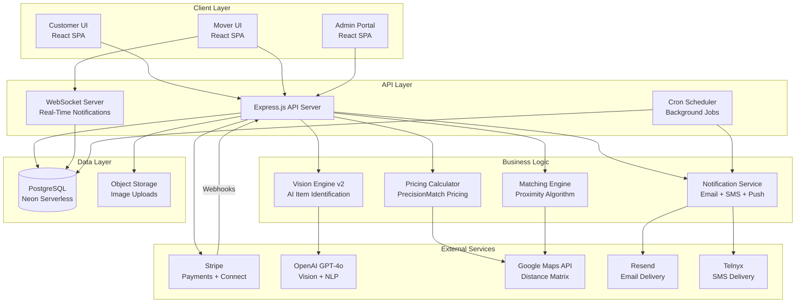
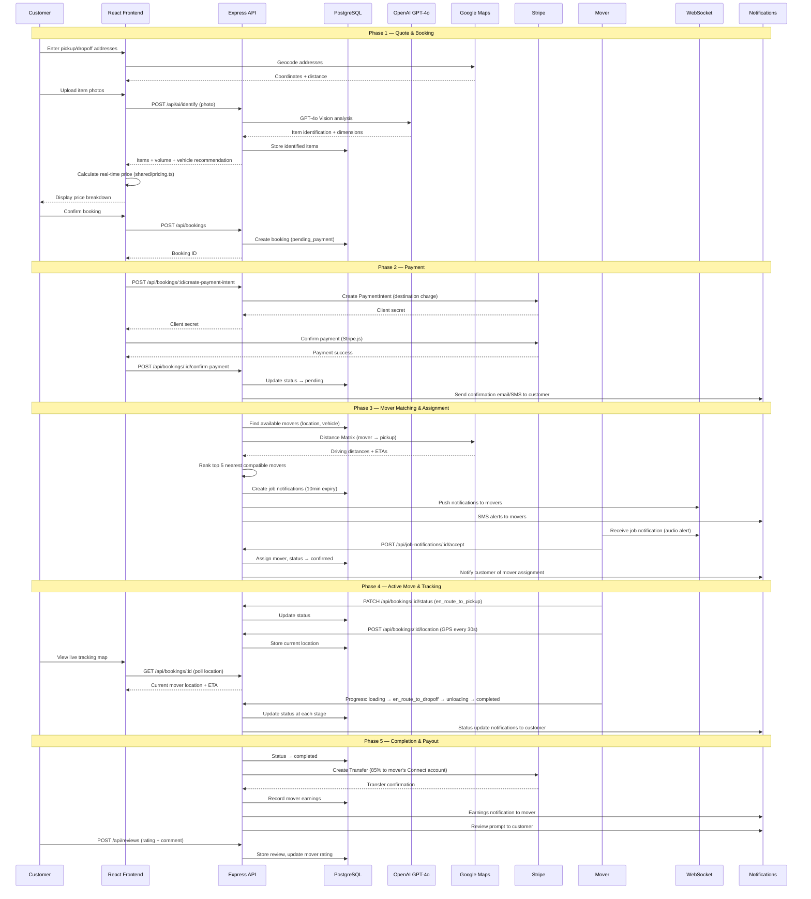

# 02 — Architecture

**Version:** 1.0  
**Date:** February 8, 2026

---

## Component Overview

The LervIT platform follows a monorepo architecture with three primary layers:

| Layer | Technology | Purpose |
|-------|-----------|---------|
| **Frontend** | React 18, TypeScript, Vite | Mobile-first SPA with role-based routing |
| **Backend** | Express.js, TypeScript, ESM | RESTful API, business logic, integrations |
| **Database** | PostgreSQL (Neon Serverless) | Persistent data store via Drizzle ORM |
| **Shared** | TypeScript modules | End-to-end type safety across frontend and backend |

### Frontend
- **Framework:** React 18 with TypeScript
- **Build Tool:** Vite (with hot module replacement)
- **Routing:** Wouter (lightweight client-side router)
- **Data Fetching:** TanStack Query v5 (caching, mutations, optimistic updates)
- **Styling:** Tailwind CSS with shadcn/ui component library
- **Animations:** Framer Motion for micro-interactions and page transitions
- **Maps:** Google Maps JavaScript API via `@react-google-maps/api`

### Backend
- **Runtime:** Node.js with Express.js
- **Language:** TypeScript (ESM modules)
- **Validation:** Zod schemas derived from Drizzle ORM table definitions
- **Authentication:** Session-based (connect-pg-simple for PostgreSQL session store)
- **File Upload:** Multer for multipart form data handling
- **Logging:** Pino-based structured JSON logging
- **Background Jobs:** node-cron for scheduled tasks

### External Services
- **Payments:** Stripe (payments, Stripe Connect for mover payouts)
- **AI:** OpenAI GPT-4o (Vision Engine, auto-quote predictor, support copilot)
- **Maps:** Google Maps Distance Matrix API (geocoding, driving distance/time)
- **Email:** Resend (transactional emails, campaign emails)
- **SMS:** Telnyx (OTP verification, booking alerts, mover notifications)
- **Search:** SerpAPI (data enrichment)

---

## Interfaces and Data Flow

```
Customer Browser                   Mover Browser
      |                                  |
      v                                  v
  [React SPA] ---- HTTP/WS -----> [Express API]
      |                                  |
      |                            [Middleware]
      |                            - Session Auth
      |                            - Zod Validation
      |                            - Multer Upload
      |                                  |
      |                            [Route Handlers]
      |                            - Auth Routes
      |                            - Booking Routes
      |                            - Mover Routes
      |                            - Payment Routes
      |                            - Admin Routes
      |                                  |
      |                            [Service Layer]
      |                            - Storage Interface
      |                            - Pricing Calculator
      |                            - Matching Engine
      |                            - Vision Engine v2
      |                            - Notification Service
      |                                  |
      v                                  v
  [Google Maps API]             [PostgreSQL (Neon)]
  [Stripe.js]                   [Object Storage]
                                [Stripe API]
                                [OpenAI API]
                                [Resend API]
                                [Telnyx API]
```

---

## High-Level Architecture Diagram

*Rendered diagram: see `diagrams/diagram_01_system_architecture.png`*



---

## Sequence Diagram: Quote to Book to Complete to Payout

*Rendered diagram: see `diagrams/diagram_02_booking_sequence.png`*



---

## Shared Module Architecture

The `/shared` directory contains TypeScript modules used by both frontend and backend, ensuring type consistency:

| Module | Purpose |
|--------|---------|
| `schema.ts` | Drizzle ORM table definitions, Zod insert schemas, TypeScript types |
| `pricing.ts` | Vehicle class configuration, price calculation, mover earnings |
| `matching.ts` | Proximity matching algorithm, vehicle compatibility, ranking |
| `furniture-database.ts` | Ground-truth furniture specifications (50+ items) |
| `geocoding.ts` | Distance calculation utilities |
| `ai.ts` | AI feature flags for enabling/disabling AI capabilities |
