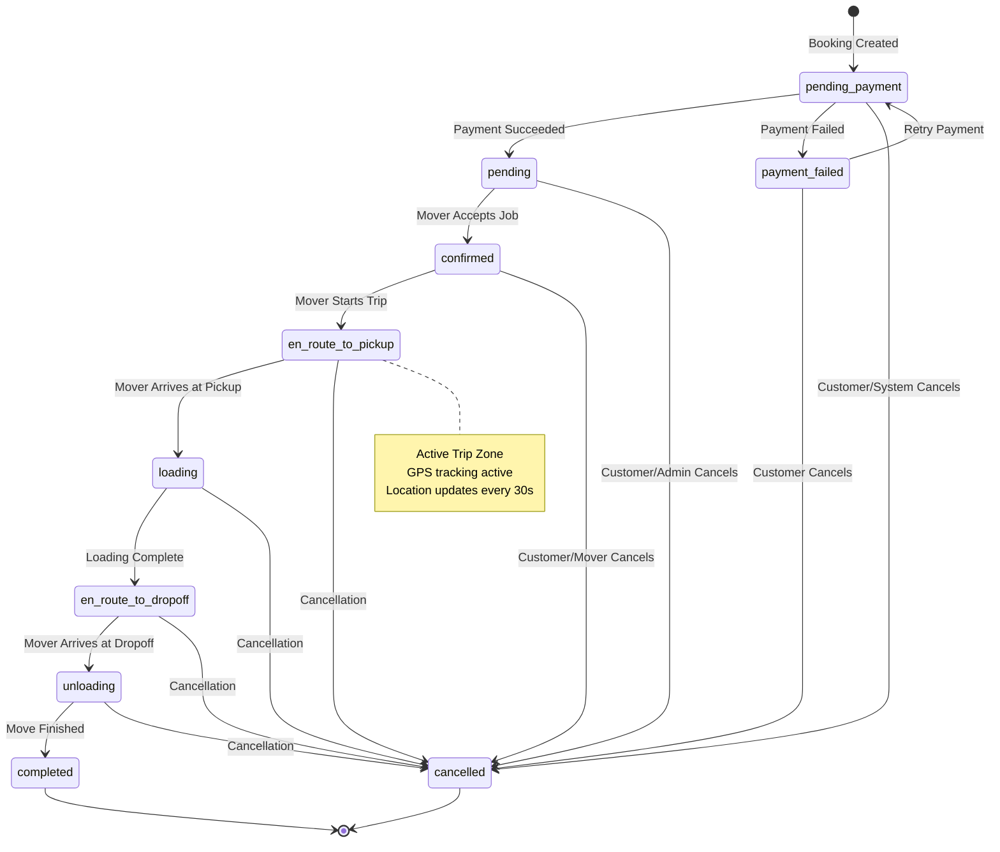

# 04 — State Machine

**Version:** 1.0  
**Date:** February 8, 2026

---

## Job Lifecycle States

The LervIT platform defines 10 discrete booking states that govern the full lifecycle of a move from payment through completion or cancellation.

| State | Label | Description |
|-------|-------|-------------|
| `pending_payment` | Awaiting Payment | Booking created, waiting for customer payment |
| `payment_failed` | Payment Failed | Payment could not be processed |
| `pending` | Pending | Payment received, waiting for mover assignment |
| `confirmed` | Confirmed | Mover assigned, waiting to start the move |
| `en_route_to_pickup` | En Route to Pickup | Mover is driving to the pickup location |
| `loading` | Loading | Mover arrived, loading items |
| `en_route_to_dropoff` | En Route to Dropoff | Mover departed with items toward destination |
| `unloading` | Unloading | Mover arrived at destination, unloading items |
| `completed` | Completed | Move successfully finished (terminal state) |
| `cancelled` | Cancelled | Move was cancelled (terminal state) |

---

## State Transitions

Each state can only transition to specific next states. This is enforced both in the shared schema (frontend validation) and in the backend API (server-side enforcement).

| Current State | Valid Next States |
|---------------|-------------------|
| `pending_payment` | `pending`, `payment_failed`, `cancelled` |
| `payment_failed` | `pending_payment`, `cancelled` |
| `pending` | `confirmed`, `cancelled` |
| `confirmed` | `en_route_to_pickup`, `cancelled` |
| `en_route_to_pickup` | `loading`, `cancelled` |
| `loading` | `en_route_to_dropoff`, `cancelled` |
| `en_route_to_dropoff` | `unloading`, `cancelled` |
| `unloading` | `completed`, `cancelled` |
| `completed` | *(terminal — no transitions)* |
| `cancelled` | *(terminal — no transitions)* |

---

## Transition Triggers

| Transition | Trigger | Actor |
|-----------|---------|-------|
| `pending_payment` → `pending` | Stripe PaymentIntent succeeded (webhook or inline confirmation) | System (Stripe webhook) |
| `pending_payment` → `payment_failed` | Stripe PaymentIntent failed | System (Stripe webhook) |
| `payment_failed` → `pending_payment` | Customer retries payment | Customer |
| `pending` → `confirmed` | Mover accepts job notification | Mover |
| `confirmed` → `en_route_to_pickup` | Mover starts the trip | Mover |
| `en_route_to_pickup` → `loading` | Mover arrives at pickup | Mover |
| `loading` → `en_route_to_dropoff` | Mover finishes loading | Mover |
| `en_route_to_dropoff` → `unloading` | Mover arrives at dropoff | Mover |
| `unloading` → `completed` | Mover finishes unloading | Mover |
| *any non-terminal* → `cancelled` | Customer cancels, admin cancels, or system auto-cancel | Customer / Admin / System |

---

## Active Statuses

A subset of statuses is designated as "active" — meaning the mover is currently working on the job. These are used for:
- GPS tracking activation
- Active trip protection (prevents auto-cancel if mover has updated location within 2 hours)
- Dashboard filtering

**Active statuses:** `en_route_to_pickup`, `loading`, `en_route_to_dropoff`, `unloading`

---

## Validation Rules

1. **Forward-only progression:** Bookings can only move forward through the status chain (except cancellation, which is available from any non-terminal state).
2. **No skip transitions:** A booking cannot jump from `confirmed` directly to `en_route_to_dropoff` — it must pass through `en_route_to_pickup` and `loading`.
3. **Server-side enforcement:** The `isValidStatusTransition()` function checks the transition map before allowing any status update.
4. **Terminal state protection:** Once a booking reaches `completed` or `cancelled`, no further transitions are allowed.
5. **Active trip protection:** Scheduled auto-cancel/auto-complete jobs check `locationUpdatedAt` — if the mover has updated GPS within 2 hours, the booking is protected from premature status changes.

---

## Payment Status (Parallel Track)

Bookings also track payment status independently:
- `pending` — No payment attempt yet
- `paid` — Payment confirmed via Stripe
- `failed` — Payment attempt failed
- `refunded` — Payment was refunded

---

## Failure States

| Scenario | Resulting State | Recovery Path |
|----------|----------------|---------------|
| Payment declined | `payment_failed` | Customer retries with different card |
| Payment timeout (30 min) | `cancelled` (auto) | Customer creates new booking |
| No mover accepts (all notifications expire) | `pending` (remains) | System can re-trigger matching |
| Mover cancels mid-trip | `cancelled` | Admin reassigns or refunds |

---

## State Diagram

*Rendered diagram: see `diagrams/diagram_03_booking_state_machine.png`*

